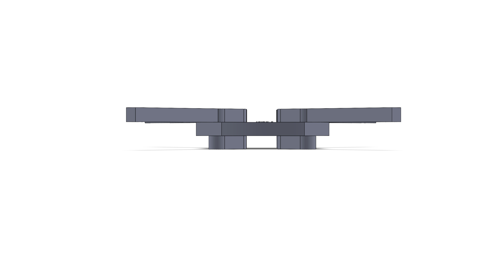
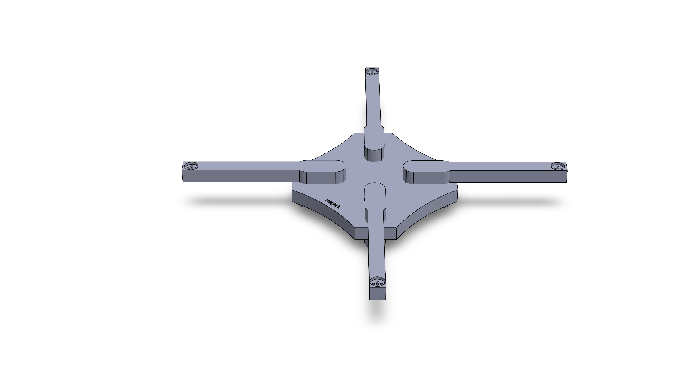
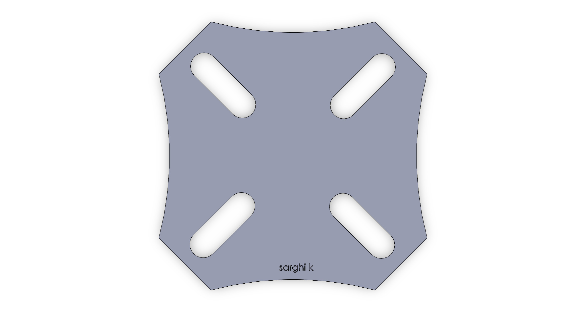
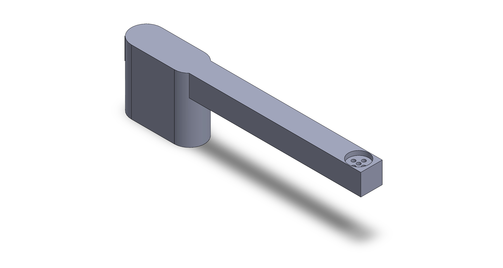

### Education
University of California Irvine

Bachelor of Science in Aerospace Engineering

### Projects

3D PRINTED DRONE

Objective: 

To develop a 3D printed lightweight quadcopter.

Process:

- Researched drone models and compared x-frames to h-frames to select the optimal structure for a lightweight, 3D-printed quadcopter.
- Utilized SolidWorks to design and model a custom drone X-frame, applying engineering principles to ensure durability and performance.
- Gained hands-on experience in 3D printing, refining design for efficient fabrication and assembly.
- Currently continuing to 3D print designs and preparing to mount the electronics.

Solidworks Progress:

